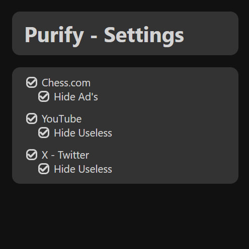
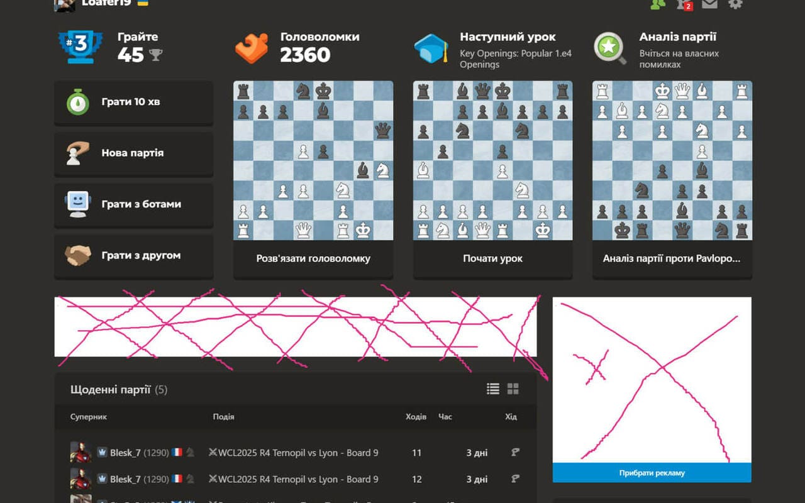
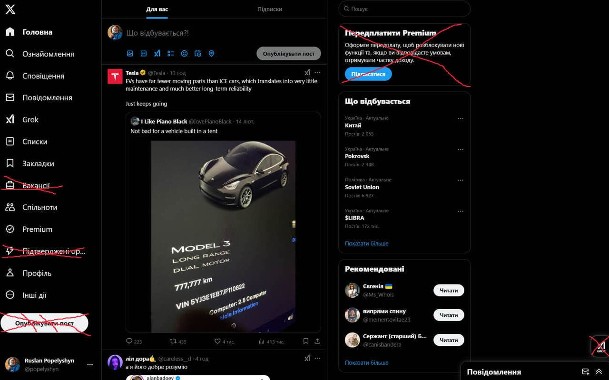

# Purify - bringing clarity to websites

Purify is a browser extension that helps you to focus on the content you are reading by removing all the distractions

## Features

- removes useless elements from the page
- per-site settings pages with toggles for each option
- DaisyUI-themed popup UI with light/dark theme support
- host aliases so the same site works across www, mobile, and alternate domains
- configure predefined settings for each site

several sites have already been optimized for a minimalist experience

The popup lists supported sites; open a site to drill down into its options.

### Neat versions of sites

#### chess.com

- removed ads

#### youtube.com

- removed useless blocks and few buttons

#### x.com

- removed useless buttons

#### twitch.tv

- hide recommended shelves / sidebar suggestions
- hide Prime, Bits, and gift promos
- optional extra chrome (stories, cheer, upcoming)

