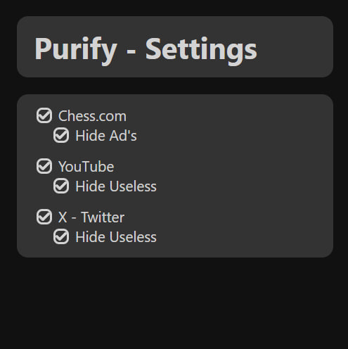
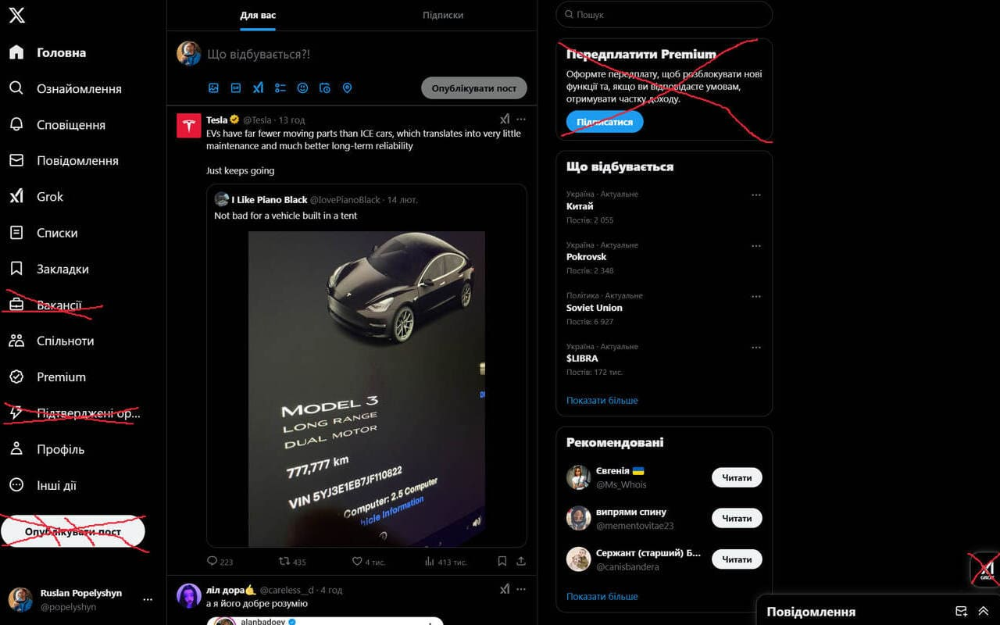

# Purify - bringing clarity to websites


Purify is a browser extension that helps you to focus on the content you are reading by removing all the distractions

## Features

- removes useless elements from the page
- configure predefined settings for each site

several sites have already been optimized for a minimalist experience



### Neat versions of sites

#### chess.com

- removed ads


#### youtube.com

- removed useless blocks and few buttons


#### x.com

- removed useless buttons




## Project Setup

Install dependencies:

```sh
bun i
```

Fill up `.env`

U good to go 💗

### Commands

Run and observe a beauty

```sh
bun dev
```

Be ready to upload your extension

```sh
bun run build
```

Improve code quality

```sh
bun run check
```
